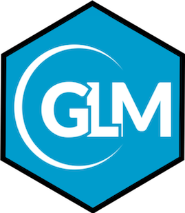

# GLM : The General Lake Model

  

The General Lake Model (GLM) is a water balance and one-dimensional vertical stratification
hydrodynamic model. It accounts for the effect of inflows/outflows, mixing and surface heating
and cooling, including the effect of ice cover. It is suited to longer-term investigations
ranging from seasons to decades, and for coupling with biogeochemical models to explore the
role that stratification and vertical mixing has on biogeochemical and ecological dynamics of lakes, reservoirs, ponds and wetlands.

 

## Accessing the model

This `GLM` repository is released coupled with the `AED` water quality model, via the **GLM-AED** release. Refer to the [`glm-aed` repository](https://github.com/AquaticEcoDynamics/glm-aed) for pre-compiled model executable files, example simulations, and information for how to get started with the model.

 

## Reference

Refer to the following paper for a scientific description of the model:

Hipsey, M.R., Bruce, L.C., Boon, C., Busch, B., Carey, C.C., Hamilton, D.P., Hanson, P.C., Read, J.S., de Sousa, E., Weber, M. and Winslow, L.A., 2019. A General Lake Model (GLM 3.0) for linking with high-frequency sensor data from the Global Lake Ecological Observatory Network (GLEON). *Geoscientific Model Development*, **12**(1), pp.473-523. [https://doi.org/10.5194/gmd-12-473-2019](https://doi.org/10.5194/gmd-12-473-2019)
