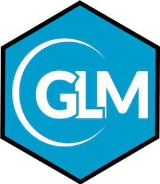

# GLM : The General Lake Model

 

The General Lake Model (GLM) is a water balance and one-dimensional vertical stratification
hydrodynamic model. It accounts for the effect of inflows/outflows, mixing and surface heating
and cooling, including the effect of ice cover. It is suited to longer-term investigations
ranging from seasons to decades, and for coupling with biogeochemical models to explore the
role that stratification and vertical mixing has on biogeochemical and ecological dynamics of lakes, reservoirs, ponds and wetlands.

 

## Release status

> [!IMPORTANT]
> **GLM 4.0.0 is in a pre-release state.**
>
> This repository holds the actively developed GLM source line. It has not yet had a
> tagged 4.0 release: input configuration, module options and output variables may still
> change ahead of that release. Users who need a stable, citable version should work from
> the most recent published [GLM-AED release](https://github.com/AquaticEcoDynamics/glm-aed)
> and should expect to revisit their configuration when 4.0.0 is finalised.

## Version lineage

| Line | Repository | Status |
|---|---|---|
| **GLM 4.x** | **this repository** | Active development — pre-release |
| GLM 3.x | [`GLM3`](https://github.com/AquaticEcoDynamics/GLM3) | Archived, no longer developed |

The 3.x line is preserved in the [`GLM3` repository](https://github.com/AquaticEcoDynamics/GLM3),
where its tagged releases (through `GLM_v3.3.0`, source to 3.3.5) and full commit history remain
available for reference and for reproducing older simulations. New development, including
everything below, happens here and is not backported to 3.x.

GLM 4.x extends the 3.x line with a restructured AED coupling interface (via `libaed-api`),
an integrated particle tracking module, a reworked surface heat exchange module, and
in-core bubbler/destratification and oxygenation modules — the last two of which were
previously distributed as optional source patches against GLM 3.

## Accessing the model

This `GLM` repository is released coupled with the `AED` water quality model, via the **GLM-AED**
release. Refer to the [`glm-aed` repository](https://github.com/AquaticEcoDynamics/glm-aed) for
pre-compiled model executable files, example simulations, and information for how to get started
with the model. Note that current `glm-aed` releases build against this 4.x source line and are
not compatible with `GLM3`.

## Reference

Refer to the following paper for a scientific description of the model:

Hipsey, M.R., Bruce, L.C., Boon, C., Busch, B., Carey, C.C., Hamilton, D.P., Hanson, P.C., Read, J.S., de Sousa, E., Weber, M. and Winslow, L.A., 2019. A General Lake Model (GLM 3.0) for linking with high-frequency sensor data from the Global Lake Ecological Observatory Network (GLEON). *Geoscientific Model Development*, **12**(1), pp.473-523. [https://doi.org/10.5194/gmd-12-473-2019](https://doi.org/10.5194/gmd-12-473-2019)

This paper documents the GLM 3.0 formulation, which remains the core of the 4.x line.
